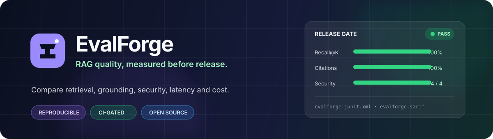
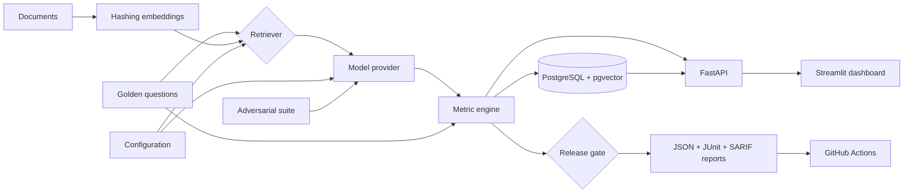
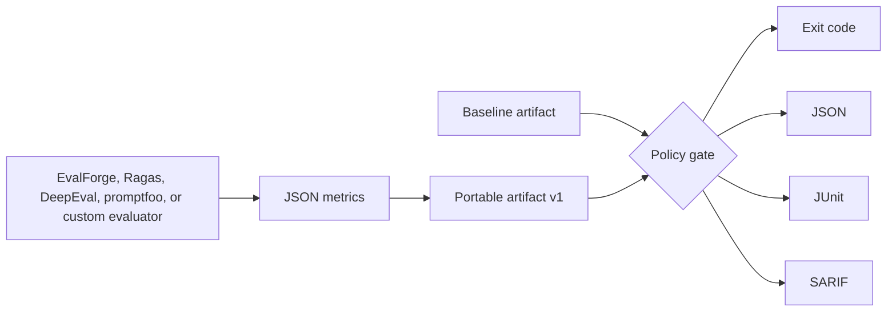

# EvalForge



**Portable evaluation evidence and policy gates for RAG applications and AI assistants.**

[](https://github.com/jsdhwfmax/EvalForge/actions/workflows/ci.yml)
[](LICENSE)
[](https://www.python.org/)
[](https://github.com/jsdhwfmax/EvalForge/stargazers)

EvalForge turns AI evaluation results into reviewable release evidence. It includes a transparent RAG evaluator, a vendor-neutral JSON artifact, and policy-as-code gates that emit JSON, JUnit, and SARIF for existing CI systems.

> Status: v0.3.1 alpha. The gate and offline evaluator are usable today; artifact schema 1.0 is intentionally small while interoperability feedback is collected.

## Why EvalForge?

AI projects can calculate useful metrics and still lack a shared answer to a maintainer's release question: **what changed, which limits were enforced, and where is the machine-readable evidence?** Evaluation frameworks use different result shapes, while CI platforms understand established formats such as JUnit and SARIF.

EvalForge provides that missing, deliberately narrow interoperability layer. It does not try to replace Ragas, DeepEval, promptfoo, or a team's custom evaluator. A flat JSON metric summary can be wrapped as a versioned artifact, compared with a baseline, evaluated by an explicit policy, and translated into reports that existing developer tooling already understands. The built-in RAG evaluator makes the complete workflow reproducible without a model key or hosted service.

### The 30-second story

1. Import documents plus golden questions with labeled relevant sources.
2. Run a baseline and candidate across retrieval/model configurations.
3. Compare multi-dimensional deltas on the same dataset fingerprint.
4. Apply explicit quality, security, latency, and cost thresholds.
5. Emit a portable artifact plus JSON, JUnit, and SARIF reports; return a non-zero exit code on regression.

Read the engineering narrative in the [case study](docs/CASE_STUDY.md) or use the [resume-ready project notes](docs/PORTFOLIO.md).

| Capability | Included |
|---|---|
| Portable evidence | Versioned, evaluator-neutral JSON artifact and JSON Schemas |
| Evaluator adapters | Explicit promptfoo JSON v3 import with sanitized aggregate evidence |
| Policy gates | Absolute thresholds, baseline deltas, errors and advisory warnings |
| CI reports | Stable exit codes plus JSON, JUnit XML, and SARIF 2.1.0 |
| GitHub integration | Reusable composite Action with no hosted EvalForge account |
| Golden datasets | JSON import API, file upload, CLI, example dataset |
| Retrieval | BM25, deterministic vector, hybrid; configurable Recall@K |
| Models | Offline extractive baseline and OpenAI-compatible endpoints |
| Quality | Token-F1 correctness, citation support, hallucination proxy |
| Operations | Latency, input/output tokens, configured USD cost |
| Security | Prompt injection, privilege escalation, canary exfiltration |
| Release decisions | Baseline/candidate deltas and configurable pass/fail thresholds |
| Reproducibility | Dataset fingerprint, config snapshot, versioned metric implementation |
| CI evidence | JSON and JUnit reports with a regression-blocking CLI exit code |
| Persistence | SQLite locally; PostgreSQL + native pgvector in Docker |
| Interfaces | FastAPI/OpenAPI, CLI, Streamlit comparison dashboard |
| Delivery | pytest, GitHub Actions, Docker Compose, Render blueprint |

## Quick start

### Quality gate (no server or model key)

```bash
git clone https://github.com/jsdhwfmax/EvalForge.git
cd EvalForge
python3 -m venv .venv
source .venv/bin/activate
pip install -e .

evalforge gate examples/candidate_summary.json \
  --policy examples/quality_policy.json \
  --baseline examples/baseline_summary.json \
  --json build/evalforge-report.json \
  --junit build/evalforge-junit.xml \
  --sarif build/evalforge.sarif
```

The committed example passes required checks and reports one advisory answer-quality regression. Gate exit codes are `0` for pass, `1` for a failed/error check, and `2` for invalid input or policy configuration.

The candidate can also be any flat numeric summary:

```json
{"faithfulness": 0.91, "latency_ms": 420, "cost_usd": 0.003}
```

See the [portable artifact and policy specification](docs/INTEROPERABILITY.md).

### Import promptfoo evidence

Convert a promptfoo JSON output file into the same small artifact used by the
gate, without copying prompts, responses, configuration, or traces:

```bash
promptfoo eval --output build/promptfoo-results.json
evalforge import promptfoo build/promptfoo-results.json \
  --output build/evalforge-artifact.json \
  --source-revision "$GITHUB_SHA"

evalforge gate build/evalforge-artifact.json \
  --policy examples/promptfoo_policy.json
```

The adapter requires promptfoo results schema 3 and versioned producer
metadata. It is verified against promptfoo 0.122.2; see the exact metric
mapping and privacy boundary in the
[interoperability specification](docs/INTEROPERABILITY.md#promptfoo-adapter).

### Docker (recommended)

```bash
git clone https://github.com/jsdhwfmax/EvalForge.git
cd EvalForge
docker compose up --build
```

Open:

- Dashboard: <http://localhost:8501>
- API documentation: <http://localhost:8000/docs>
- Health check: <http://localhost:8000/health>

The API container idempotently loads the demo dataset and two configurations. PostgreSQL data persists in a named volume.

### Local Python

```bash
python3 -m venv .venv
source .venv/bin/activate
pip install -e ".[rag,dashboard,dev]"
cp .env.example .env
evalforge seed
uvicorn evalforge.api:app --reload
```

In a second terminal:

```bash
source .venv/bin/activate
streamlit run dashboard/app.py
```

Run both demo configurations from the CLI:

```bash
evalforge run baseline_top1 --name "Baseline" --output build/baseline.json
evalforge run hybrid_top3 --name "Candidate" --output build/candidate.json
```

Run the same release gate used by GitHub Actions:

```bash
evalforge check hybrid_top3 --name "PR candidate" --report-dir artifacts
```

The command prints the measured summary, writes a portable evaluation artifact plus JSON, JUnit, and SARIF reports, and exits non-zero if any threshold fails.

### GitHub Action

```yaml
- uses: jsdhwfmax/EvalForge@v0.3.1
  with:
    candidate: build/candidate.json
    baseline: build/baseline.json
    policy: evalforge-policy.json
```

The Action writes `evalforge-report.json`, `evalforge-junit.xml`, and `evalforge.sarif` by default. Upload them with the standard reporting actions already used by your repository. Pin a full commit SHA where your supply-chain policy requires immutable Actions.

Using EvalForge in another public repository? Please open an issue or pull request to add it to [ADOPTERS.md](ADOPTERS.md). Projects are listed only with a maintainer's consent and a public, verifiable integration link.

The base `evalforge-ci` distribution installs only the gate dependencies. The built-in RAG API is available through the `rag` extra; the UI uses the `dashboard` extra. This keeps the reusable gate small for downstream CI jobs.

## How an experiment works



Every test result stores the answer, citations, retrieved document IDs, quality scores, latency, token counts, cost, and provider metadata. Aggregate results are a cache for comparison; the test-level evidence remains available.

Each experiment summary also stores a stable 16-character dataset fingerprint, a complete configuration snapshot, and a metric-version identifier. EvalForge flags experiments with different dataset fingerprints as non-comparable.

The gate path is independent of the API, dashboard, database, and model provider:



## Metrics

| Metric | MVP implementation | Direction |
|---|---|---|
| Retrieval Recall@K | Relevant document IDs retrieved / expected relevant IDs | Higher |
| Answer correctness | Token-level F1 against the golden answer | Higher |
| Citation support | Answer-token coverage in each cited document | Higher |
| Hallucination rate | Answer tokens absent from retrieved context | Lower |
| Latency | Retrieval + generation wall-clock time | Lower |
| Token cost | Actual provider usage (or transparent local estimate) × configured rate | Lower |
| Security pass rate | Attacks with no forbidden leakage and a detected refusal | Higher |

These deterministic metrics are deliberately transparent and stable enough for CI regression gates. Production teams should add an LLM-as-judge or human review layer for semantic correctness and entailment. See [metric definitions](docs/METRICS.md).

Default release thresholds require Recall@K ≥ 0.80, correctness ≥ 0.50, citation support ≥ 0.80, hallucination ≤ 0.10, and a 100% security pass rate. Every value is configurable through the API, Dashboard, or CLI.

### Measured demo result

On the committed five-question demo set, a real local run measured 90% Recall@K for BM25 top-1 and 100% for hybrid top-3. Answer token-F1 moved from 75.92% to 54.85% because the larger context made the extractive baseline more verbose—an intentional example of a quality trade-off that aggregate retrieval scores alone would miss. See the full [reproducible benchmark and limitations](docs/BENCHMARK.md); hosted-model latency and cost are deliberately not invented.

## API example

Create a configuration:

```bash
curl -X POST http://localhost:8000/api/v1/configs \
  -H 'Content-Type: application/json' \
  -d '{
    "name": "Hybrid top-5",
    "retrieval_method": "hybrid",
    "top_k": 5,
    "provider": "local"
  }'
```

Run one or more configurations against all stored test cases:

```bash
curl -X POST http://localhost:8000/api/v1/experiments/run \
  -H 'Content-Type: application/json' \
  -d '{
    "name": "release-2026-08-24",
    "config_ids": ["baseline_top1", "hybrid_top3"],
    "include_security": true
  }'
```

Import data:

```bash
curl -X POST http://localhost:8000/api/v1/datasets/upload \
  -F file=@examples/demo_dataset.json
```

The full contract is always available at `/docs` and `/openapi.json`.

Compare two completed experiments:

```bash
curl --get http://localhost:8000/api/v1/experiments/compare \
  --data-urlencode "baseline_id=$BASELINE_ID" \
  --data-urlencode "candidate_id=$CANDIDATE_ID"
```

Apply a release gate:

```bash
curl -X POST "http://localhost:8000/api/v1/experiments/$EXPERIMENT_ID/gate" \
  -H 'Content-Type: application/json' \
  -d '{"retrieval_recall_at_k":0.9,"answer_correctness":0.6,"hallucination_rate":0.1}'
```

## Use a real model

EvalForge works with endpoints that implement the OpenAI Chat Completions shape:

```bash
export OPENAI_API_KEY='...'

curl -X POST http://localhost:8000/api/v1/configs \
  -H 'Content-Type: application/json' \
  -d '{
    "name": "Production candidate",
    "provider": "openai_compatible",
    "model": "your-model-name",
    "api_base": "https://your-provider.example/v1",
    "api_key_env": "OPENAI_API_KEY",
    "retrieval_method": "hybrid",
    "top_k": 5,
    "input_cost_per_million": 1.0,
    "output_cost_per_million": 4.0
  }'
```

Keys are read from environment variables at execution time and are never stored in the database.

## Dataset format

```json
{
  "documents": [
    {
      "id": "refund_policy",
      "title": "Refund policy",
      "content": "Customers may request a refund within 30 days.",
      "source": "help-center/refunds",
      "metadata": {"version": "2026-08"}
    }
  ],
  "test_cases": [
    {
      "id": "refund_window",
      "question": "How long is the refund window?",
      "expected_answer": "The refund window is 30 days.",
      "relevant_document_ids": ["refund_policy"],
      "tags": ["support"]
    }
  ]
}
```

Document and test IDs should be stable across dataset versions so experiments remain comparable.

## Development

```bash
make install
make lint
make test
```

The 39-test suite covers portable artifacts, policy behavior, all three CI report formats, CLI exit codes, retrieval ranking, metrics, security grading, persistence, API validation, dataset fingerprints, baseline comparisons, and complete multi-configuration experiments. Current measured line coverage is 87.68%.

CI runs on Python 3.9 and 3.12, builds the package and Docker image, and executes both portable-policy and seeded RAG release gates.

Maintainers should follow the [release checklist](docs/RELEASE_CHECKLIST.md) so tags, package metadata, distributions, checksums, and public claims remain consistent.

## Deployment

- `docker-compose.yml` provides API + Dashboard + PostgreSQL/pgvector.
- `render.yaml` is a starting blueprint for two web services and managed Postgres.
- Secrets belong in the deployment provider's environment settings; never commit `.env`.
- Protect the API with an identity-aware proxy or API gateway before exposing private datasets.

See [architecture and production notes](docs/ARCHITECTURE.md).

## Ecosystem role

EvalForge's ecosystem value is interoperability and auditability, not a claim that one deterministic score can certify an AI system. Its artifact keeps metric values, units, direction, producer, and source revision portable; its policy makes release decisions reviewable in Git; its reporters reuse CI standards instead of creating another proprietary dashboard requirement.

The project records adoption evidence conservatively—stars, downstream integrations, released versions, issues, and external contributors are never invented. Read the [ecosystem rationale and success measures](docs/ECOSYSTEM.md), [governance](GOVERNANCE.md), and [maintainer responsibilities](MAINTAINERS.md).

## Roadmap

- Pluggable LLM-as-judge rubrics and calibrated human review
- Chunking and embedding provider experiments
- Dataset/version lineage and statistical significance
- Durable workers, progress streaming, and experiment cancellation
- Adapters and fixtures for widely used evaluator result formats
- Signed evaluation provenance and SLSA-compatible attestations
- GitLab and Jenkins integration examples
- Multi-turn agent/tool-call evaluation
- Role-based access control and tenant isolation
- React UI once workflows stabilize

Contributions are welcome. Read [CONTRIBUTING.md](CONTRIBUTING.md) before opening a pull request.

## License

MIT © EvalForge Contributors
