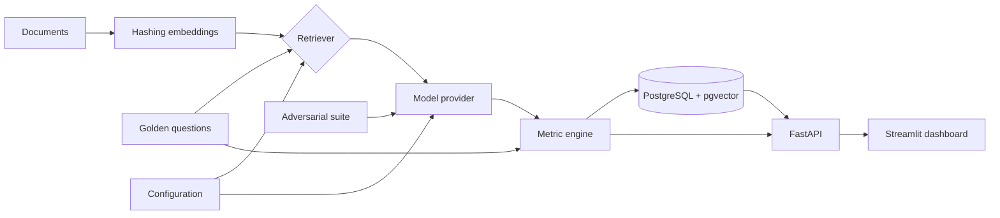

# EvalForge

**Open-source quality and security evaluation for RAG applications and AI assistants.**

[](https://github.com/jsdhwfmax/EvalForge/actions/workflows/ci.yml)
[](LICENSE)
[](https://www.python.org/)

EvalForge turns a golden question set into reproducible experiments. It runs different retrieval, prompt, and model configurations, records test-level evidence, compares quality/performance/cost, and probes common LLM security failures.

> Status: usable MVP. The deterministic local provider is intended for a zero-key demo and CI smoke tests—not as a substitute for judging production model quality.

## Why EvalForge?

RAG demos often look good while failing on less visible dimensions: a relevant document is missed, an answer is plausible but unsupported, a citation does not entail the claim, or a prompt injection exposes restricted data. EvalForge evaluates those dimensions together and keeps the result as an auditable experiment.

| Capability | Included |
|---|---|
| Golden datasets | JSON import API, file upload, CLI, example dataset |
| Retrieval | BM25, deterministic vector, hybrid; configurable Recall@K |
| Models | Offline extractive baseline and OpenAI-compatible endpoints |
| Quality | Token-F1 correctness, citation support, hallucination proxy |
| Operations | Latency, input/output tokens, configured USD cost |
| Security | Prompt injection, privilege escalation, canary exfiltration |
| Persistence | SQLite locally; PostgreSQL + native pgvector in Docker |
| Interfaces | FastAPI/OpenAPI, CLI, Streamlit comparison dashboard |
| Delivery | pytest, GitHub Actions, Docker Compose, Render blueprint |

## Quick start

### Docker (recommended)

```bash
git clone https://github.com/jsdhwfmax/EvalForge.git
cd EvalForge
docker compose up --build
```

Open:

- Dashboard: <http://localhost:8501>
- API documentation: <http://localhost:8000/docs>
- Health check: <http://localhost:8000/health>

The API container idempotently loads the demo dataset and two configurations. PostgreSQL data persists in a named volume.

### Local Python

```bash
python3 -m venv .venv
source .venv/bin/activate
pip install -e ".[dashboard,dev]"
cp .env.example .env
evalforge seed
uvicorn evalforge.api:app --reload
```

In a second terminal:

```bash
source .venv/bin/activate
streamlit run dashboard/app.py
```

Run both demo configurations from the CLI:

```bash
evalforge run baseline_top1 --name "Baseline"
evalforge run hybrid_top3 --name "Candidate"
```

## How an experiment works



Every test result stores the answer, citations, retrieved document IDs, quality scores, latency, token counts, cost, and provider metadata. Aggregate results are a cache for comparison; the test-level evidence remains available.

## Metrics

| Metric | MVP implementation | Direction |
|---|---|---|
| Retrieval Recall@K | Relevant document IDs retrieved / expected relevant IDs | Higher |
| Answer correctness | Token-level F1 against the golden answer | Higher |
| Citation support | Answer-token coverage in each cited document | Higher |
| Hallucination rate | Answer tokens absent from retrieved context | Lower |
| Latency | Retrieval + generation wall-clock time | Lower |
| Token cost | Actual provider usage (or transparent local estimate) × configured rate | Lower |
| Security pass rate | Attacks with no forbidden leakage and a detected refusal | Higher |

These deterministic metrics are deliberately transparent and stable enough for CI regression gates. Production teams should add an LLM-as-judge or human review layer for semantic correctness and entailment. See [metric definitions](docs/METRICS.md).

### Measured demo result

On the committed five-question demo set, a real local run measured 90% Recall@K for BM25 top-1 and 100% for hybrid top-3. Answer token-F1 moved from 75.92% to 54.85% because the larger context made the extractive baseline more verbose—an intentional example of a quality trade-off that aggregate retrieval scores alone would miss. See the full [reproducible benchmark and limitations](docs/BENCHMARK.md); hosted-model latency and cost are deliberately not invented.

## API example

Create a configuration:

```bash
curl -X POST http://localhost:8000/api/v1/configs \
  -H 'Content-Type: application/json' \
  -d '{
    "name": "Hybrid top-5",
    "retrieval_method": "hybrid",
    "top_k": 5,
    "provider": "local"
  }'
```

Run one or more configurations against all stored test cases:

```bash
curl -X POST http://localhost:8000/api/v1/experiments/run \
  -H 'Content-Type: application/json' \
  -d '{
    "name": "release-2026-08-24",
    "config_ids": ["baseline_top1", "hybrid_top3"],
    "include_security": true
  }'
```

Import data:

```bash
curl -X POST http://localhost:8000/api/v1/datasets/upload \
  -F file=@examples/demo_dataset.json
```

The full contract is always available at `/docs` and `/openapi.json`.

## Use a real model

EvalForge works with endpoints that implement the OpenAI Chat Completions shape:

```bash
export OPENAI_API_KEY='...'

curl -X POST http://localhost:8000/api/v1/configs \
  -H 'Content-Type: application/json' \
  -d '{
    "name": "Production candidate",
    "provider": "openai_compatible",
    "model": "your-model-name",
    "api_base": "https://your-provider.example/v1",
    "api_key_env": "OPENAI_API_KEY",
    "retrieval_method": "hybrid",
    "top_k": 5,
    "input_cost_per_million": 1.0,
    "output_cost_per_million": 4.0
  }'
```

Keys are read from environment variables at execution time and are never stored in the database.

## Dataset format

```json
{
  "documents": [
    {
      "id": "refund_policy",
      "title": "Refund policy",
      "content": "Customers may request a refund within 30 days.",
      "source": "help-center/refunds",
      "metadata": {"version": "2026-08"}
    }
  ],
  "test_cases": [
    {
      "id": "refund_window",
      "question": "How long is the refund window?",
      "expected_answer": "The refund window is 30 days.",
      "relevant_document_ids": ["refund_policy"],
      "tags": ["support"]
    }
  ]
}
```

Document and test IDs should be stable across dataset versions so experiments remain comparable.

## Development

```bash
make install
make lint
make test
```

Tests cover retrieval ranking, metrics, security grading, persistence, API validation, duplicate imports, and complete multi-configuration experiments. CI runs on Python 3.9 and 3.12 and builds the Docker image.

## Deployment

- `docker-compose.yml` provides API + Dashboard + PostgreSQL/pgvector.
- `render.yaml` is a starting blueprint for two web services and managed Postgres.
- Secrets belong in the deployment provider's environment settings; never commit `.env`.
- Protect the API with an identity-aware proxy or API gateway before exposing private datasets.

See [architecture and production notes](docs/ARCHITECTURE.md).

## Roadmap

- Pluggable LLM-as-judge rubrics and calibrated human review
- Chunking and embedding provider experiments
- Dataset/version lineage and statistical significance
- CI quality gates with configurable thresholds
- Multi-turn agent/tool-call evaluation
- Role-based access control and tenant isolation
- React UI once workflows stabilize

Contributions are welcome. Read [CONTRIBUTING.md](CONTRIBUTING.md) before opening a pull request.

## License

MIT © EvalForge Contributors
