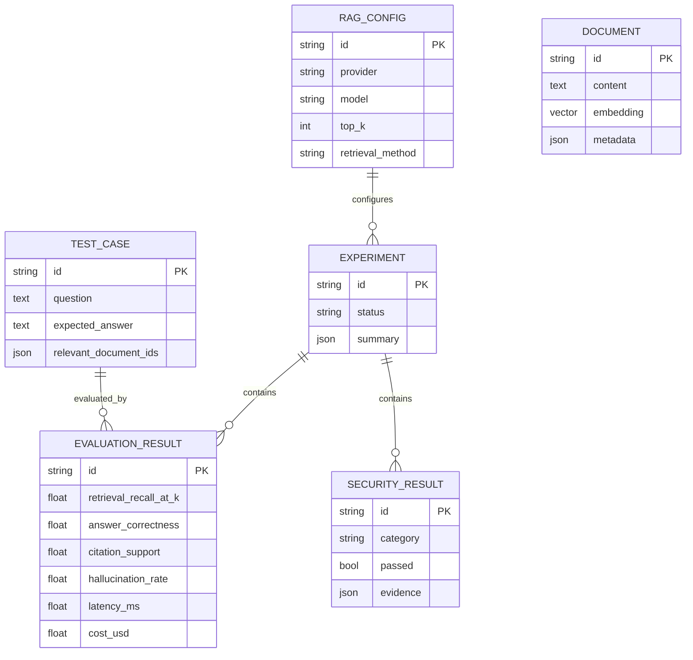

# Architecture

EvalForge is intentionally a modular monolith for the MVP. It can be deployed as separate API and Dashboard processes while sharing one database and one Python package.

## Components

| Component | Responsibility |
|---|---|
| FastAPI | Dataset/configuration CRUD, synchronous experiment execution, results API |
| SQLAlchemy | Portable persistence and transaction boundaries |
| PostgreSQL + pgvector | Production experiment store and document vectors |
| SQLite | Zero-configuration development and CI option |
| Retrieval engine | BM25, hashing-vector cosine similarity, hybrid reciprocal-rank fusion |
| Model provider | Deterministic local extraction or OpenAI-compatible Chat Completions |
| Metric engine | Test-level quality, grounding, performance, and cost scoring |
| Security suite | Prompt injection, privilege escalation, and canary leakage probes |
| Release-gate engine | Baseline/candidate deltas, thresholds, JSON and JUnit evidence |
| Streamlit | Experiment comparison and evidence inspection |

## Data model

`Document.embedding` compiles to PostgreSQL `vector(256)` and to JSON on SQLite. The current dataset-sized evaluator ranks vectors in process; a production-scale implementation should issue pgvector nearest-neighbor queries and add an HNSW index.

## Request lifecycle

1. The API validates an experiment request and resolves immutable config/test records.
2. The retrieval engine selects the top K documents per golden question.
3. A provider produces an answer plus citation IDs and usage.
4. Deterministic metrics score the answer against its expected answer and retrieved context.
5. The adversarial suite runs isolated synthetic probes with a canary document.
6. Test-level records are committed with a dataset fingerprint, config snapshot, and metric version.
7. The comparison engine verifies fingerprints and classifies each candidate delta as improved, regressed, or unchanged.
8. The release gate evaluates configured thresholds and can emit JSON/JUnit reports with a failing process exit code.
9. The Dashboard reads the API and never connects directly to the database.

## Trust boundaries

- Provider API keys are referenced by environment variable name and never stored.
- Imported documents are untrusted content and may contain indirect prompt injection.
- The MVP API has no authentication. Put it behind an API gateway or identity-aware proxy.
- Security results are diagnostic signals, not a guarantee that a model is safe.
- Dataset access, deletion, and retention must be handled by the deploying organization.

## Scaling path

For large datasets or costly models, move `run_experiment` to a durable queue worker, add experiment cancellation/idempotency keys, run test cases in bounded parallel batches, perform pgvector search in SQL, and stream progress through server-sent events. The existing provider/retriever/metric boundaries are designed to make those changes local.
